# TP2

## Fed AVG
results for FED AVG are saved in the following files:
ALPHA 1: `fl_history_round_1.json`  
ALPHA 0.1: `fl_history_round_2.json`  
ALPHA 10: `fl_history_round_3.json`  

## Step 2
This is taken care of by the `model.py` file  

## Step 3
This is taken care of by the `client.py` file  

## Step 4
This is taken care of by the `run_client.py` file. The command `python3 run_client.py --cid INTEGER` will run the client. The server must be running or else the client will fail  

## Step 5
The client manager is taken care of by the `custom_client_manager.py` file and the strategy is taken care of by the `fed_avg.py` file  

## Step 6
The server is contained in the `run_server.py` file. The following command runs the server `python3 run_server.py`  

## Step 7
This is taken care of by the `run_visualizer.py` file. The following command runs the data visualization: `python3 run_visualizer.py  --output NAME_OF_OUTPUT`  
Results are saved to the `plots` folder and end with what the user has enetered for NAME_OF_OUTPUT. The title of each plots also contains the NAME_OF_OUTPUT string

## Step 8
Hyperparameters are saved to the `config.py`  
In order to run the simulation, Multiple terminal tabs need to be opened. Each terminal will need to run the virtual environment in the folder. Complete the following steps to run the simulation
1. Open terminal and run `source venv/bin/activate` to run the Python virtual environment  
2. Run `python3 run_server.py`. The server will now be waiting for the specified number of clients to connect
3. Open as many terminal tabs as clients are required
4. In each newly opened terminal, run the following commands:
    1. `source venv/bin/activate` to run the Python virtual environment  
    2. `python3 run_client.py --cid INTEGER` making sure to change the CID Integer for each client  
5. Wait for the tests to complete
6. Run `python3 run_visualizer.py --output NAME_OF_OUTPUT` to generate the images for reporting  

### Simulation 1
Num of clients: 10  
Alpha: 1  
Rounds: 30  
Epochs: 1  
Dataset: Fashion MNIST  
Batch size: 32  
Learning Rate: 0.01  
[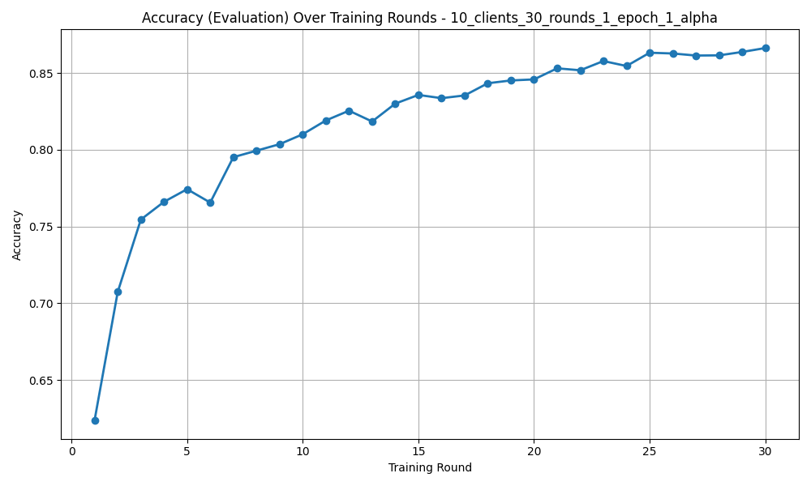](plots/accuracy_eval_plot_10_clients_30_rounds_1_epoch_1_alpha.png)
[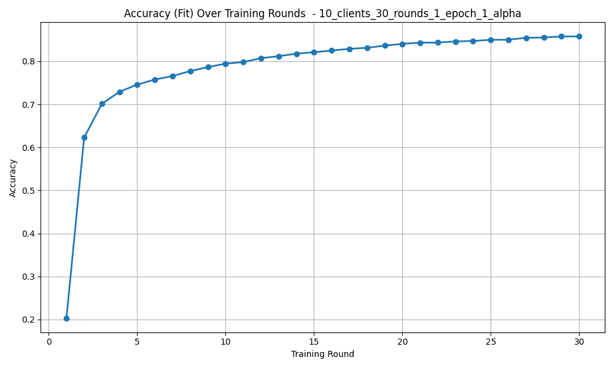](plots/accuracy_fit_plot_10_clients_30_rounds_1_epoch_1_alpha.png)
[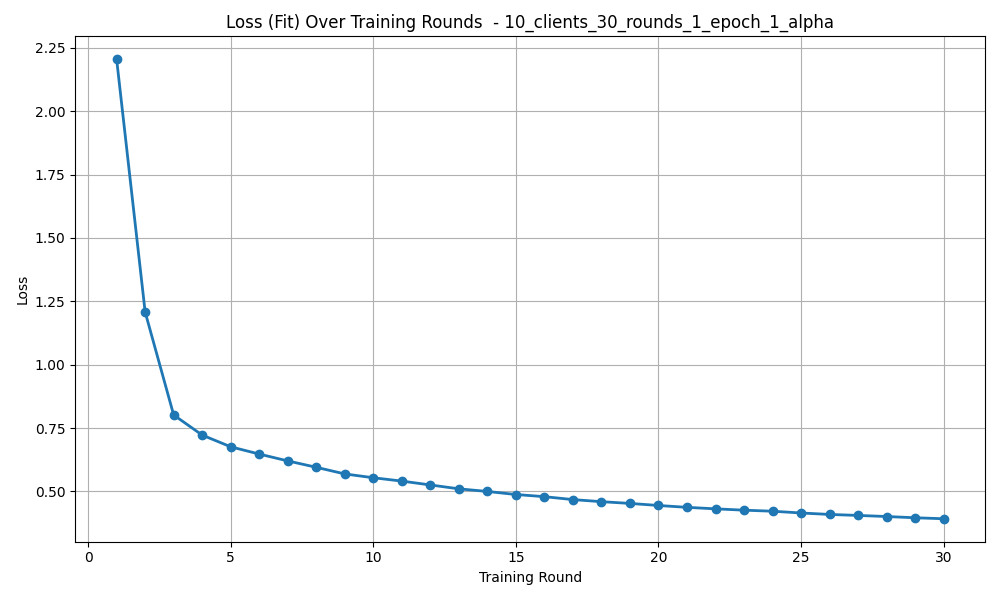](plots/loss_fit_plot_10_clients_30_rounds_1_epoch_1_alpha.png)
[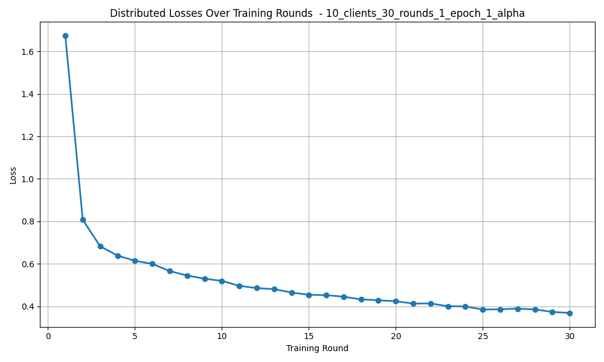](plots/losses_distributed_plot_10_clients_30_rounds_1_epoch_1_alpha.png)

Since this is our first simulation and it uses all the given hyper parameters, we will use this as a baseline for future simulations.  

### Simulation 2
Num of clients: 10  
Alpha: 5  
Rounds: 30  
Epochs: 1  
Dataset: Fashion MNIST  
Batch size: 32  
Learning Rate: 0.01   
[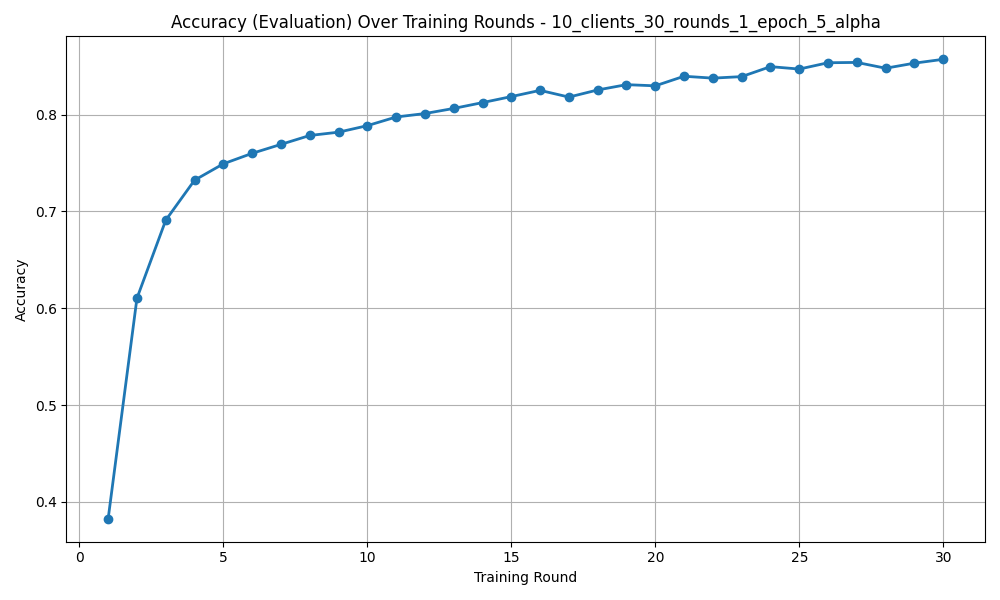](plots/accuracy_eval_plot_10_clients_30_rounds_1_epoch_5_alpha.png)
[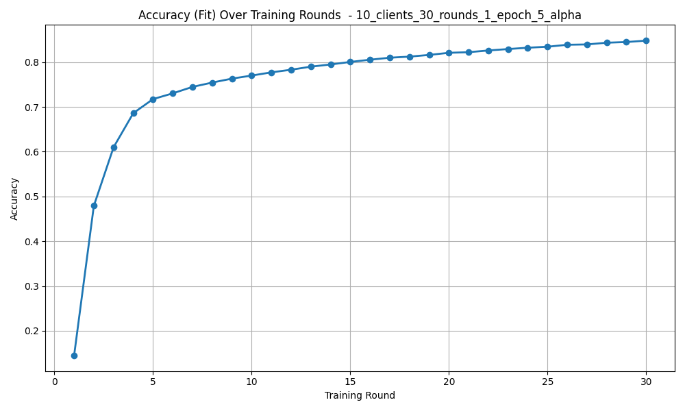](plots/accuracy_fit_plot_10_clients_30_rounds_1_epoch_5_alpha.png)
[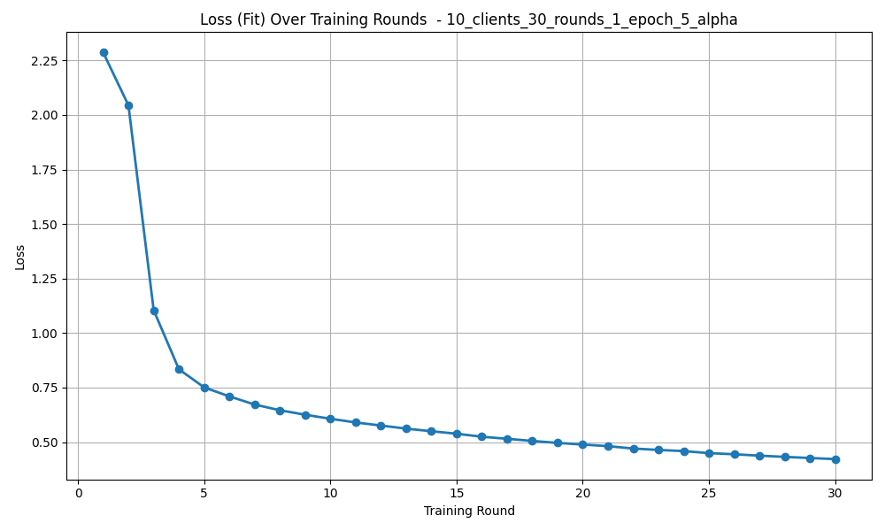](plots/loss_fit_plot_10_clients_30_rounds_1_epoch_5_alpha.png)
[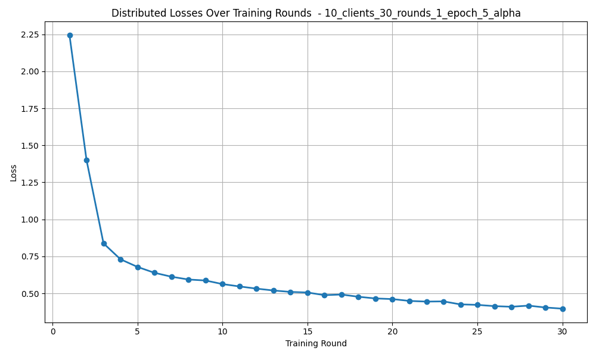](plots/losses_distributed_plot_10_clients_30_rounds_1_epoch_5_alpha.png)

In this simulation, I kept all parameters the same but increased the Alpha from 1 to 5. We can see that learning is slightly more stable than before which makes sense due to the increased homogenity in the datasets as a direct result from the increase in Alpha. With more overlapping data, we expect the local minima of each client to be closer than before, leading to less variation in the plot history. This is most prominent on the Accuracy Evaluation plot.  

### Simulation 3
Num of clients: 10  
Alpha: 1  
Rounds: 30  
Epochs: 3  
Dataset: Fashion MNIST  
Batch size: 32  
Learning Rate: 0.01  
[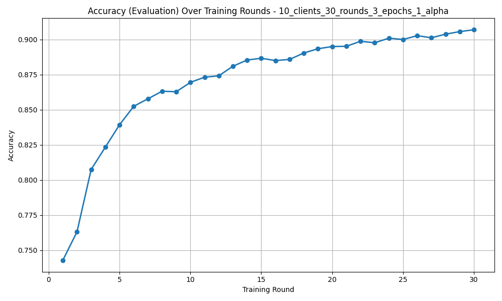](plots/accuracy_eval_plot_10_clients_30_rounds_3_epochs_1_alpha.png)
[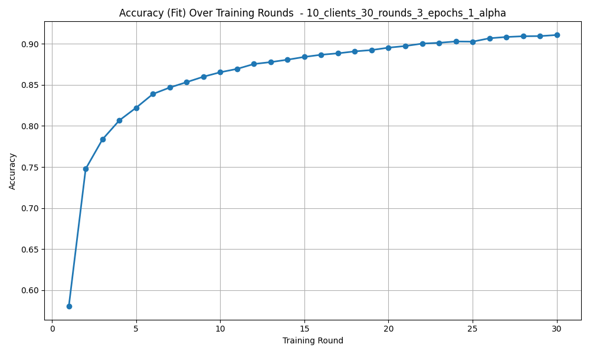](plots/accuracy_fit_plot_10_clients_30_rounds_3_epochs_1_alpha.png)
[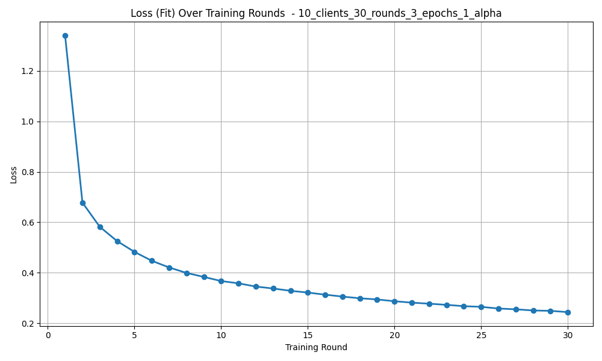](plots/loss_fit_plot_10_clients_30_rounds_3_epochs_1_alpha.png)
[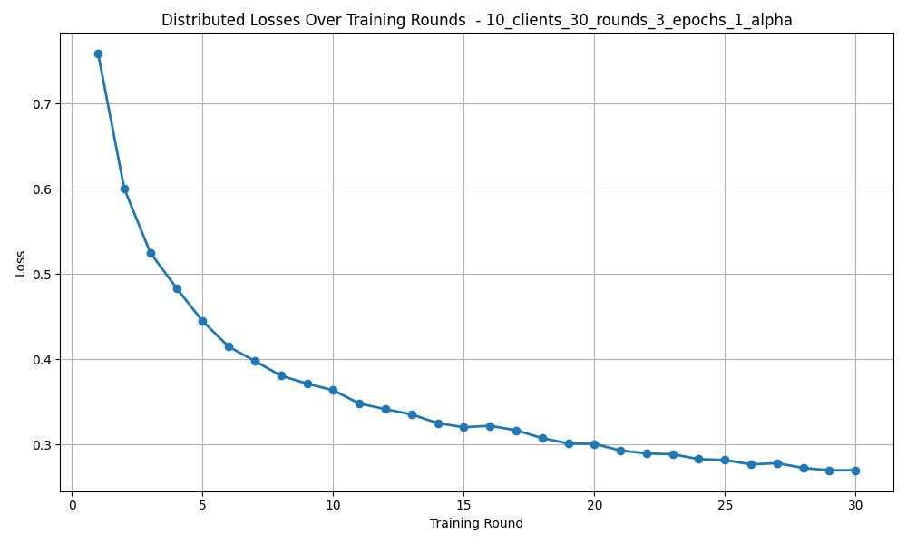](plots/losses_distributed_plot_10_clients_30_rounds_3_epochs_1_alpha.png)

In this simulation, I kept all parameters the same from the 1st simulation but increased the Epoch count from 1 to 3. The learning appears to also be slightly more stable than the baseline, potentially due to the fact that the higher epoch count gives the clients more instances to train the model and adjust the weights. I was expecting there to be more client drift, giving plots with more variations but that was not the case in this simulation.  

### Simulation 4
num of clients: 5  
alpha: 1  
rounds: 30  
epoch: 3  
[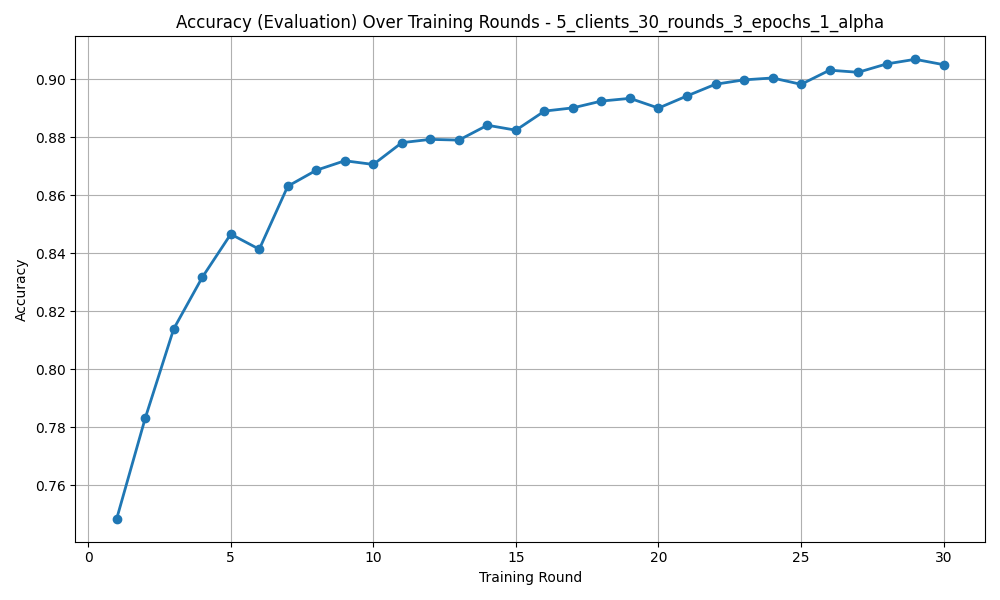](plots/accuracy_eval_plot_5_clients_30_rounds_3_epochs_1_alpha.png)
[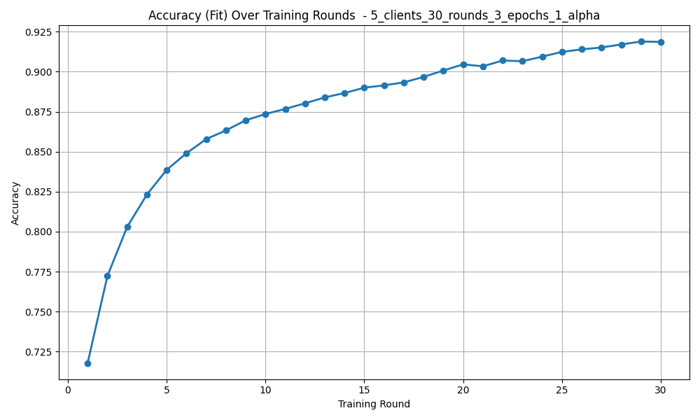](plots/accuracy_fit_plot_5_clients_30_rounds_3_epochs_1_alpha.png)
[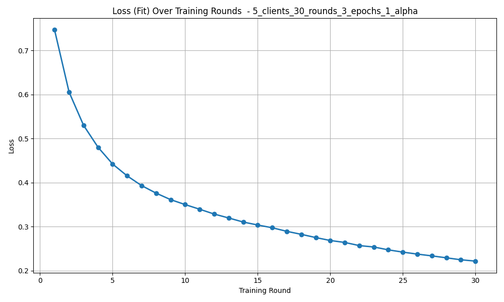](plots/loss_fit_plot_5_clients_30_rounds_3_epochs_1_alpha.png)
[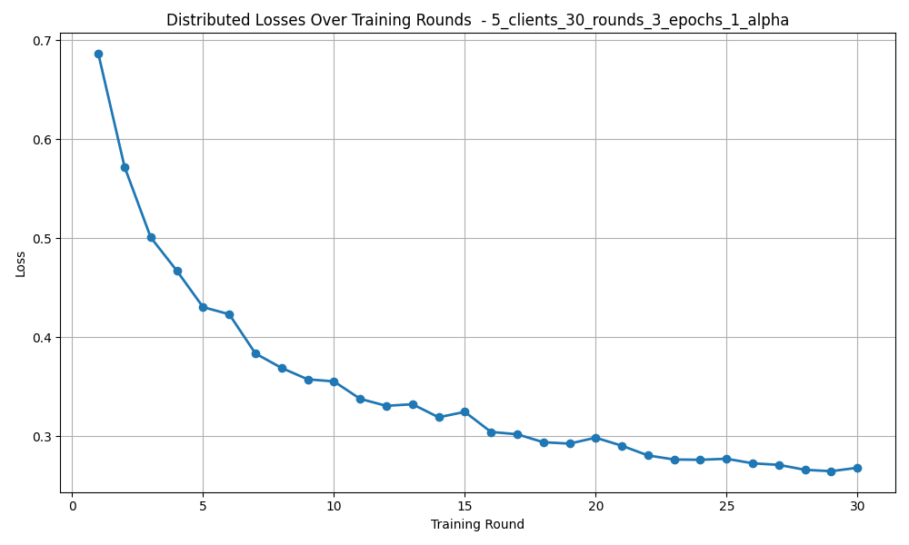](plots/losses_distributed_plot_5_clients_30_rounds_3_epochs_1_alpha.png)

In this simulation, I kept all parameters the same from the 3rd simulation but decreased the Client count from 10 to 5. This made the learning more unstable which isn't too surprising, as we have fewer gradients than before and a low alpha, so we can expect any client drift to have a larger effect on the model than before. Surprisingly though, the simulations ends up giving similar end results compared to simulation 3.  