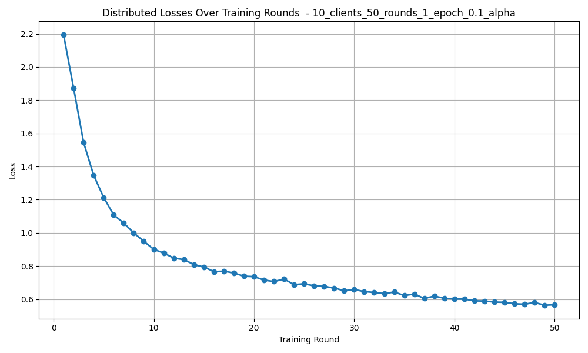
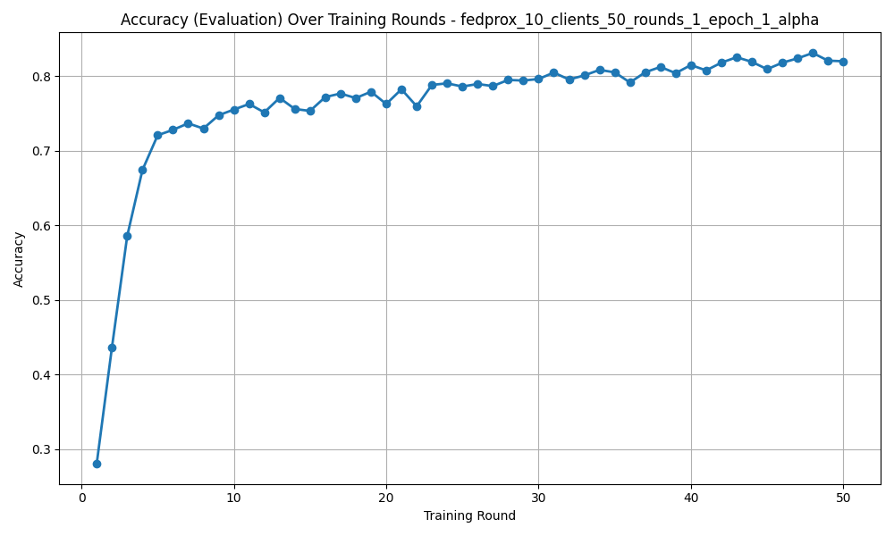
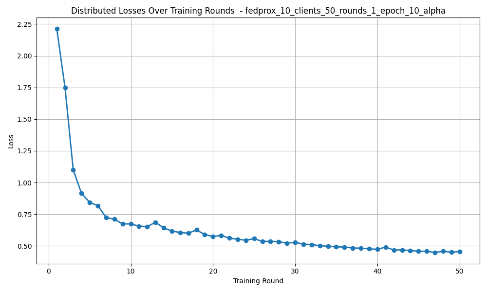
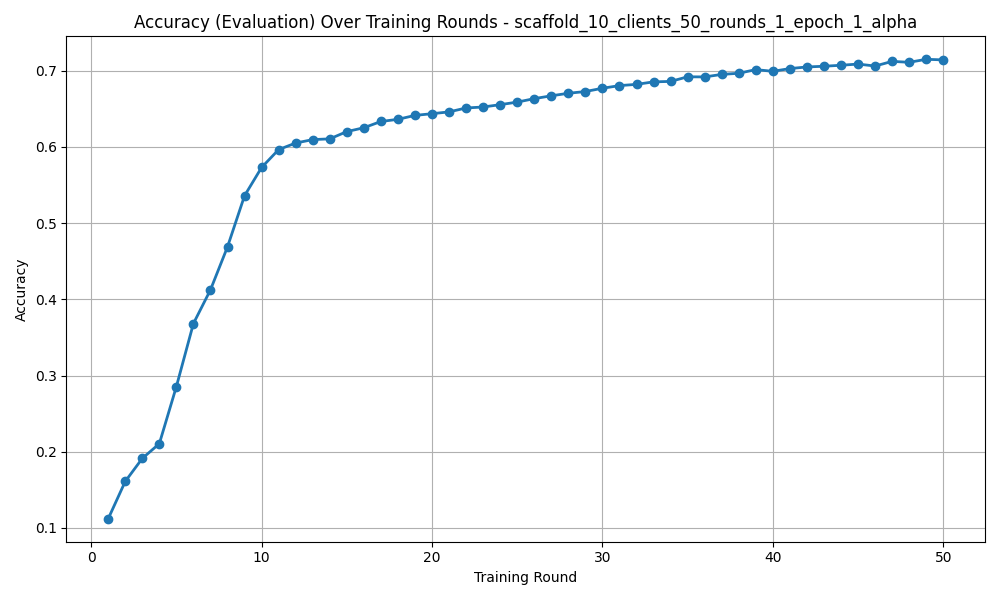
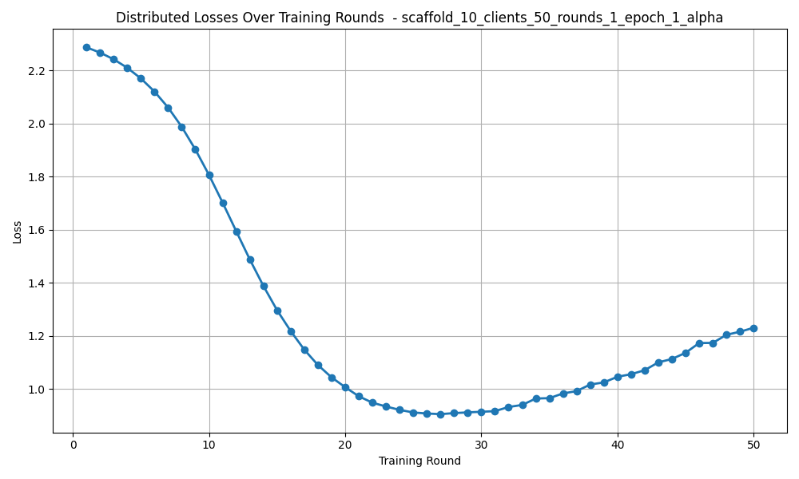

# TP2

## Fed AVG
results for FED AVG are saved in the following files:  
ALPHA 0.1:  `fl_history_round_1.json`  
ALPHA 1:    `fl_history_round_2.json`  
ALPHA 10:   `fl_history_round_3.json`  

The code for this simulation is contained in the following files:  
client:     `client.py`  
strategy:   `fed_avg.py`  
model:      `model.py`  
run client: `run_client.py`  
server:     `run_server.py`  

### Results
#### Alpha 0.1

#### Alpha 1

#### Alpha 10

Alpha 0.1:  
Accuracy evaluation ≈ 0.79  
Accuracy fit ≈ 0.93  
Loss fit ≈ 0.22  
Loss distributed ≈ 0.58  

Alpha 1:  
Accuracy evaluation ≈ 0.82  
Accuracy fit ≈ 0.85  
Loss fit ≈ 0.4  
Loss distributed ≈ 0.47  

Alpha 10:  
Accuracy evaluation ≈ 0.84  
Accuracy fit ≈ 0.83  
Loss fit ≈ 0.46  
Loss distributed ≈ 0.46  

### Results Summary
During Alpha 0.1, we see a large difference between the accuracy fit (accuracy on training data) and the accuracy evaluation (accuracy on test data). We can also see something similar for the loss values, where loss fit (weighted avg of loss on training data) is much lower than the distributed loss (aggregated loss across clients). I believe this is due to the non-IID nature of this data. It's very easy for the clients to overfit on their training data, leading to bad results on unseen data. Their training data is oversimplified and is lacking the complexity that leads to good generalization. The learning curves on aggregations are bumpy as well, which hints that the learning is unstable, likely due to overfitting. Due to the simplified nature of Fed Avg, it doesn't do well to adjust the model with low IID data.  

During Alpa 1, there is still a descrepency between accuracy evaluation and accuracy fit, but it is pretty small. Something similar is happening with loss as well, where loss fit ends slightly lower than loss distributed. With lower data heterogeneity, the clients are able to generalize better than before and we even see a higher accuracy evaluation when compared to Alpha 0.1. It looks like the learning is much less prone to overfitting, and the learning curves on aggregated data are much less bumpy, which is a good sign that the learning is stablizing between clients. Although the data is moderately heterogenous, the Fed Avg strategy still seems to struggle slightly with aggregating results effectively.  

During Alpha 10, we see essentially the same results for accuracy and loss. This makes sense as an alpha of 10 is large and ensures low data heterogenity acros all clients. If all clients are receiving similar training datasets, aggregating clients should lead to similar results, which is ultimately what we are seeing. Lastly, we see a higher accuracy evaluation on Alpha 10 than any other Alpha value. The learning curves on aggregated data is very smooth as well, which tells us that the learning is very stable between each client and we aren't seeing overfitting on each client.  At this point, the minimally heterogenous nature of the data masks the shortcomings of the Fed Avg strategy.  

## Fed Prox
results for FED Prox are saved in the following files:  
ALPHA 0.1:  `fl_history_round_4.json`  
ALPHA 1:    `fl_history_round_5.json`   
ALPHA 10:   `fl_history_round_6.json`  

client:     `client_fedprox.py`  
strategy:   `fed_prox.py`  
model:      `model_fedprox.py`  
run client: `run_client_fedprox.py`  
server:     `run_server_fedprox.py`  

### Results
#### Alpha 0.1

#### Alpha 1

#### Alpha 10

Alpha 0.1:  
Accuracy evaluation ≈ 0.8  
Accuracy fit ≈ 0.93  
Loss fit ≈ 0.2  
Loss distributed ≈ 0.57  

Alpha 1:  
Accuracy evaluation ≈ 0.85  
Accuracy fit ≈ 0.85  
Loss fit ≈ 0.4  
Loss distributed ≈ 0.37  

Alpha 10:  
Accuracy evaluation ≈ 0.84  
Accuracy fit ≈ 0.83  
Loss fit ≈ 0.46  
Loss distributed ≈ 0.46  

### Results Summary
During Alpha 0.1 for Fed Prox, we see something pretty similar again. There's a large difference between the accuracy fit (accuracy on training data) and the accuracy evaluation (accuracy on test data). Something similar happens for the loss values as well, with loss fit (weighted avg of loss on training data) being much lower than the distributed loss (aggregated loss across clients). This is somewhat expected as Fed Prox doesn't do great on low heterogenous data.  

During Alpa 1, we see promising improvements on our accuracy and loss data. Accuracy evaluation and loss end at essentially the same value while loss fit and distributed are separated by a very small margin. This is definitely an improvement compared to Alpha 1 when using Fed Avg where there were small differences between the loss and accuracy points.  

During Alpha 10, we see very similar results for accuracy and loss. Like in Fed Avg, I believe the similarities in loss and accuracy are due to the data being highly heterogenous and less likely due to the strategy that we're using.  

## Scaffold
results for FED Prox are saved in the following files:  
ALPHA 0.1: `fl_history_round_7.json`  
ALPHA 1: `fl_history_round_8.json`  
ALPHA 10: `fl_history_round_9.json`  

The code for this simulation is contained in the following files:  
client:     `client_scaffold.py`  
strategy:   `scaffold.py`  
model:      `model_scaffold.py`  
run client: `run_client_scaffold.py`  
server:     `run_server_scaffold.py`  

### Results
#### Alpha 0.1

#### Alpha 1

#### Alpha 10

Alpha 0.1:  
Accuracy evaluation ≈ 0.42  
Accuracy fit ≈ 0.77  
Loss fit ≈ 0.74  
Loss distributed ≈ 2.55  

Alpha 1:  
Accuracy evaluation ≈ 0.72  
Accuracy fit ≈ 0.77  
Loss fit ≈ 1.03  
Loss distributed ≈ 1.22  

Alpha 10:  
Accuracy evaluation ≈ 0.72  
Accuracy fit ≈ 0.73  
Loss fit ≈ 1.41  
Loss distributed ≈ 1.43  

### Results Summary
During Alpha 0.1 for Scaffold, we get a pretty similar pattern as before. We have a large difference between the accuracy fit (accuracy on training data) and the accuracy evaluation (accuracy on test data). We see similar results for the loss values as well, with loss fit (weighted avg of loss on training data) being much lower than the distributed loss (aggregated loss across clients). This was unexpected to me as I thought that scaffold would provide better generatlization than Fed Avg or Fed Prox, but the data might just not be heterogeneous enough for it to work well.  

During Alpa 1, we see pretty similar results between our accuracy and loss measure, but the difference is larger than it was with Fed Prox.  

During Alpha 10, we see very similar results for accuracy and loss. Like in Fed Avg, I believe the similarities in loss and accuracy are due to the data being highly heterogenous and less likely due to the strategy that we're using.  